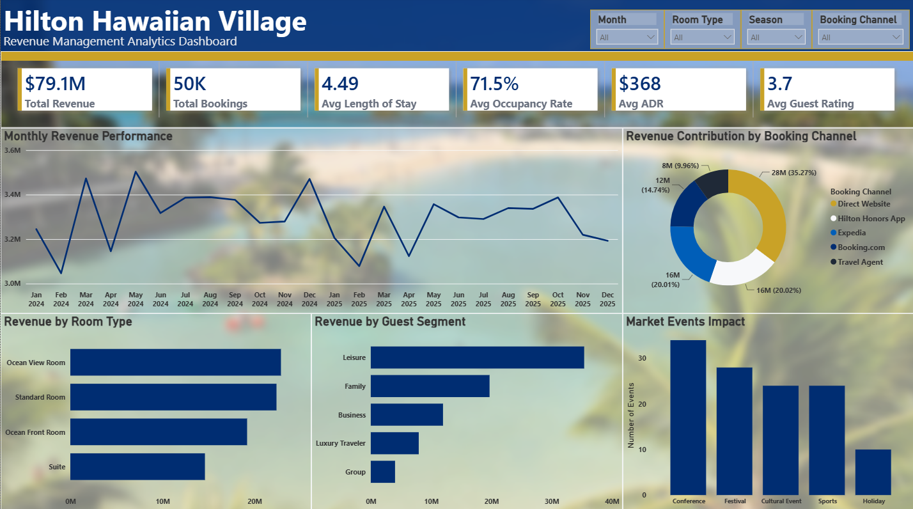

# 🏨 Hilton Revenue Management Analytics

An end-to-end Revenue Management Analytics project that analyzes hotel booking performance to identify revenue optimization opportunities through demand analysis, pricing strategy, occupancy trends, competitor benchmarking, market events, and guest satisfaction. The project demonstrates the complete analytics workflow—from data generation and cleaning in Python, business analysis in MySQL, interactive dashboard development in Power BI, and communicating actionable insights through a professional business report.

---

## 📖 Project Overview

Revenue management is critical to maximizing hotel profitability through data-driven pricing and demand forecasting. This project simulates a real-world business case for Hilton Hawaiian Village Waikiki Beach Resort, focusing on optimizing revenue by analyzing booking trends, occupancy, ADR (Average Daily Rate), seasonality, competitor pricing, market events, and guest experience.

This project answers the business question:

> **"How can Hilton optimize pricing, occupancy, and revenue by leveraging historical booking data, market trends, competitor pricing, and guest insights?"**

---

## 📂 Dataset

**Dataset:** Synthetic Hotel Revenue Management Dataset

### Dataset Summary

- **Records:** 50,000+
- **Tables:** 5
- Booking Transactions
- Daily Hotel KPIs
- Competitor Pricing
- Guest Reviews
- Market Events

---

## 🛠️ Tools & Technologies

| Tool | Purpose |
|------|---------|
| **Python (Pandas, NumPy, SQLAlchemy)** | Data generation, cleaning, preprocessing, feature engineering, EDA, and exporting cleaned data to MySQL |
| **MySQL Workbench** | Revenue analysis, pricing analysis, demand analysis, competitor benchmarking, and business reporting |
| **Power BI** | Interactive revenue management dashboard and KPI visualization |
| **Microsoft Word** | Professional business report |

---

## 📊 Project Workflow

### 1. Data Generation & Preparation
- Generated a realistic hotel revenue management dataset using Python.
- Simulated booking transactions, hotel KPIs, competitor pricing, guest reviews, and market events.
- Performed exploratory analysis to understand data structure.

### 2. Data Cleaning & Feature Engineering
- Validated missing values and duplicates.
- Standardized data formats and categorical variables.
- Created booking month and season features.
- Prepared relational tables for SQL analysis.
- Exported cleaned datasets to MySQL.

### 3. SQL Business Analysis

Performed business analysis using MySQL to answer key revenue management questions, including:

- Revenue by room type
- Monthly and seasonal revenue performance
- Dynamic pricing opportunities
- Occupancy vs ADR analysis
- Competitor pricing comparison
- Room pricing opportunities
- Market event impact on demand
- Revenue optimization by event
- Guest satisfaction analysis
- Guest satisfaction vs booking value

### 4. Dashboard Development

Built an interactive Revenue Management Dashboard in Power BI featuring:

### KPI Cards

- Total Revenue
- Total Bookings
- Average Length of Stay
- Average Occupancy Rate
- Average ADR
- Average Guest Rating

### Visualizations

- Monthly Revenue Performance
- Revenue Contribution by Booking Channel
- Revenue by Room Type
- Revenue by Guest Segment
- Market Events Impact

### Interactive Filters

- Month
- Season
- Room Type
- Booking Channel

  

### 5. Business Reporting

Created a professional business report summarizing:

- Revenue management insights
- SQL analysis
- Dashboard findings
- Strategic business recommendations

---

## 🔍 Key Findings

### 🛏️ Room Revenue Performance
- **Ocean View Rooms generated the highest revenue ($22.87M)**, contributing **28.92%** of total revenue from **15,022 bookings**, while **Suites achieved the highest ADR ($734.11)** despite lower booking volume.

### 📈 Seasonal Demand Analysis
- **Peak Season consistently achieved over 88% occupancy**, ADR up to **$488.75**, and monthly revenue exceeding **$77M**, whereas Low Season occupancy declined to nearly **53%** with revenue below **$27M**.

### 💰 Dynamic Pricing Opportunity
- **Very High demand periods reached 94.12% occupancy with a $529.09 ADR**, while Low demand periods averaged only **45.02% occupancy and $249.83 ADR**, highlighting opportunities for demand-based pricing.

### 🏨 Occupancy & ADR Relationship
- Average ADR increased from **$249.54** at low occupancy to **$459.00** at high occupancy, while RevPAR increased from **$106.82** to **$406.88**, confirming a strong positive relationship.

### 📊 Competitor Benchmarking
- Hilton maintained an average ADR of **$368.02**, remaining within **±$1** of major competitors, demonstrating effective market positioning.

### 🎉 Market Events & Revenue
- **Cultural Festivals generated $16.48M in revenue**, followed by **Tourism Expos ($16.05M)** and **Surf Competitions ($15.48M)**, making them the highest-value recurring events.

### ⭐ Guest Experience
- Positive guest reviews generated **$10.37M** in booking revenue compared to **$2.35M** from negative reviews, while **Check-in Experience (3.72/5)** received the highest satisfaction rating.

---

## 💡 Business Recommendations

| # | Recommendation | Business Impact |
|---|---------------|-----------------|
| 1 | Implement **dynamic pricing strategies** based on occupancy, seasonality, and demand levels | Maximize ADR while maintaining occupancy |
| 2 | Prioritize **Ocean View Rooms and Suites** through premium packages and upselling | Increase revenue from the highest-value room categories |
| 3 | Develop **event-based pricing and inventory strategies** around festivals, conferences, and holidays | Capture additional revenue during high-demand periods |
| 4 | Continuously monitor **competitor ADR and market trends** to refine pricing decisions | Maintain market competitiveness while protecting profitability |
| 5 | Improve **guest experience**, particularly check-in efficiency, cleanliness, and room quality | Increase guest satisfaction, repeat bookings, and long-term revenue |

---

## ▶️ How to Run

1. Clone this repository.
2. Open the Python notebook and install the required libraries.
3. Run the data generation, cleaning, and preprocessing workflow.
4. Export the cleaned datasets to MySQL.
5. Execute the SQL queries in MySQL Workbench.
6. Open the Power BI (`.pbix`) dashboard for interactive analysis.
7. Review the business report for insights and recommendations.

---

## 🎯 Project Outcomes

This project demonstrates practical skills in:

- Revenue Management Analytics
- Data Cleaning & Preprocessing
- Exploratory Data Analysis (EDA)
- Feature Engineering
- SQL Querying
- Pricing Strategy
- Demand Analysis
- Occupancy Analysis
- ADR Analysis
- Competitor Benchmarking
- Revenue Reporting
- Business Intelligence
- Power BI Dashboard Development
- Data Visualization
- Data Storytelling
- Business Reporting
- Strategic Business Recommendations

---

## 👤 Author

**Adhya Rastogi**
**LinkedIn:** https://www.linkedin.com/in/adhyarastogi/
